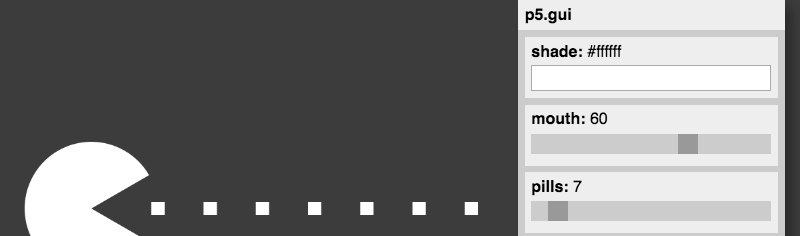

# p5.gui

  

**p5.gui** magically generates a graphical user interface (sliders, color selector, etc) for each of your variables. Behind the scenes it uses other libraries such as Quicksettings (and in the future also DAT.GUI) to do all the hard work.

You currently need to include both `p5.gui.js` and `quicksettings.js` in your p5.js sketch.

## Usage

[Explore the examples](https://bitcraftlab.github.io/p5.gui) for how to use it ...

### Add Global Variables

Create your variables

```js
let myNumber = 100;
let myColor = color(255, 0, 0);
let myChoice = ['one', 'two', 'three'];
```

Create a new GUI with a label

```js
var gui = createGui('My awesome GUI');
```

Add gui elements for your variables:  

```js
gui.addGlobals('myColor', 'myNumber', 'myChoice');
```

p5.gui inspects the type of your variables and magically displays the corresponding GUI elements.

*An example can be found [here](examples/quicksettings-1).*

### Use Magic Variables to control individual sliders

Once you have created a variable called `myNumber` you can control the details of the slider like this:

```js
let myNumber = 100;
let myNumberMin = 0;
let myNumberMax = 1000;
let myNumberStep = 10;
gui.addGlobals('myNumber');
```

p5.gui will magically pick up variables ending in `Min`, `Max` and `Step` to  control the appearance of the slider.

*See [here](examples/slider-range-1) for an example.*

### Use sliderRange() to control slider creation

If you want explicitly control the range of a couple of sliders you can also use the `sliderRange(min, max, step)` command.

This will set the range for all future calls to p5.gui.

```js
let a = 100;
let b = 120;
let c = 120;
sliderRange(0, 1000, 10);
gui.addGlobals('a', 'b', 'c');
```

*See [here](examples/slider-range-2) and [here](examples/quicksettings-2) for an example.*

### Pass params as objects

If you want to keep all your parameters in a single place, you can wrap them into an object like this:

```js
let params = {
	myNumber: 100,
	myColor: [255, 0, 0],
	myChoice: ['one', 'two', 'three'];
};

gui.addObject(params);
```

Slider Magic works just as with global variables:

```js
let params = {
	myNumber: 100,
	myNumbeMin: 0,
	myNumbeMax: 1000,
	myNumbeStep: 10
};
```

*See [here](examples/slider-range-3) for an example.*

### Pass your sketch in instance mode

If you want to run your processing sketch in [instance mode](https://github.com/processing/p5.js/wiki/Global-and-instance-mode), you need to pass your sketch to the createGui function.  Here's a simple example:

```js
let sketch = function(p) {

	let div;

	let params = {
		r: 500
	};

	p.setup = function() {
		div = p.canvas.parentElement;
		p.createCanvas(div.clientWidth, div.clientHeight);
		gui = p.createGui(this);
		gui.addObject(params);
	};

	p.draw = function() {
		p.background(220);
		p.ellipse(p.width/2, p.height/2, params.r, params.r);
	};

	p.windowResized = function() {
		p.resizeCanvas(div.clientWidth, div.clientHeight);
	};

}

new p5(sketch, 'sketch1');
new p5(sketch, 'sketch2');
new p5(sketch, 'sketch3');
new p5(sketch, 'sketch4');
```

*You can find this example [here](examples/instance-mode-1).*

### One sketch, many guis

You can just create several guis, and position them individually:

```js
let gui1 = p.createGui('My 1st GUI');
gui1.moveTo(50, 50);
gui1.addGlobals('a', 'b', 'c');

let gui2 = p.createGui('My 2nd GUI');
gui2.moveTo(windowWidth - 50, 50);
gui2.addGlobals('e', 'f', 'g');
```

See [here](examples/quicksettings-2) for an example.

### Many sketches, many guis

When using Instance Mode (see above) you can can easily create several sketches, or versions of a single sketch.

See [here](examples/slider-range-4) for an example.

### Color Modes

You can use the `colorMode()` function to change the default color mode used to interpret colors when creating the GUI.


## Examples
* [Pacman](examples/pacman/)
* [Quicksettings 1](examples/quicksettings-1/)
* [Quicksettings 2](examples/quicksettings-2/)
* [Slider Range 1](examples/slider-range-1/)
* [Slider Range With Objects](examples/slider-range-3/)

## Links
* [Codepen Template](https://codepen.io/bitcraftlab/pen/GNKmGg) feat Pacman

## Licensing

  

`p5.gui` is licensed under the MIT License.

This repo also includes code from other libraries:  

* [p5.js](https://github.com/processing/p5.js) is licensed under LGPL 2.1
* [DAT.GUI](https://github.com/dataarts/dat.gui) is licensed under Apache 2.0
* [Quicksettings.js](https://github.com/bit101/quicksettings) is licensed under MIT
